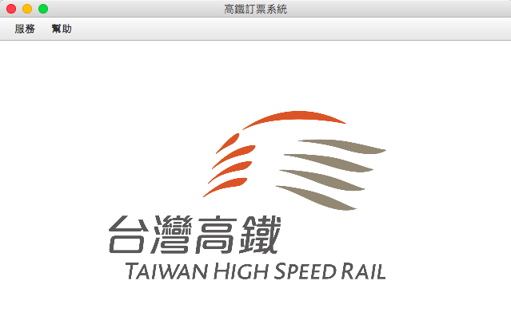

# Taiwan High Speed Rail(THSR) Booking System - Software Engineering Approach

We designed a Java GUI Program aiming to provide a THSR Booking System by software engineering(ex. UML, MVC model, design pattern).

## Getting Started
* Install [JDK 11](https://www.oracle.com/technetwork/java/javase/downloads/jdk11-downloads-5066655.html)
* Download [Eclipse IDE for Java Developers(2018-09)](https://www.eclipse.org/downloads/packages/release/2018-09/r/eclipse-ide-java-developers)
* Download [MySQL Community Server](https://dev.mysql.com/downloads/mysql/)
	* Create MySQL database
		* Username: `ooad`
		* Password: `password`
	* Run `source OOAD/test_dao.sql` in MySQL shell.
* Download [JavaFx SDK](https://gluonhq.com/products/javafx/) for your favorite OS
	* Following these instructions on Eclipse IDE:
		* Create a User Library: Eclipse -> Window -> Preferences -> Java -> Build Path -> User Libraries -> New. Name it JavaFX11 and include the jars under the lib folder from JavaFX 11-ea.
		* Create a Java project. You don't need to add a module-path class. Make sure that you select Java 11 and you add the JavaFX11 library to the project's modulepath.
		* Add runtime arguments. Edit the project's run configuration, and add these VM arguments:
		* <https://stackoverflow.com/questions/52144931/how-to-add-javafx-runtime-to-eclipse-in-java-11>
* Click `Run` on Eclipse IDE

## Project Snapshots
### Use Case Menu Bar

### Book Ticket Use Case

### Search Book Id

### Search Reserve

### Search Train

### About

## Authors:
* [jimlinntu](https://github.com/jimlinntu)
* [heyhummingbird](https://github.com/heyhummingbird)
* [rederice](https://github.com/rederice)
* [yao11617](https://github.com/yao11617)

## Acknowledgement
* Our instructor - [Huang Chien-Kang](https://www.facebook.com/chienkanghuang)